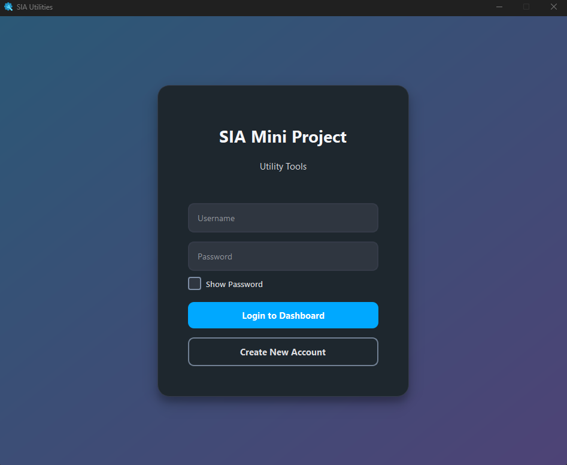
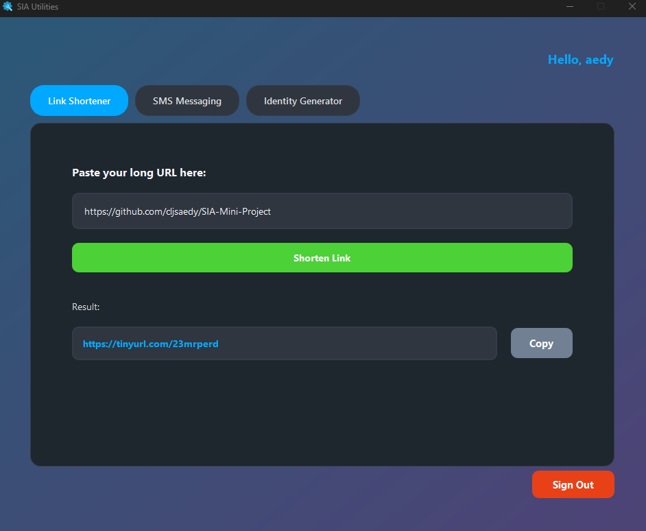
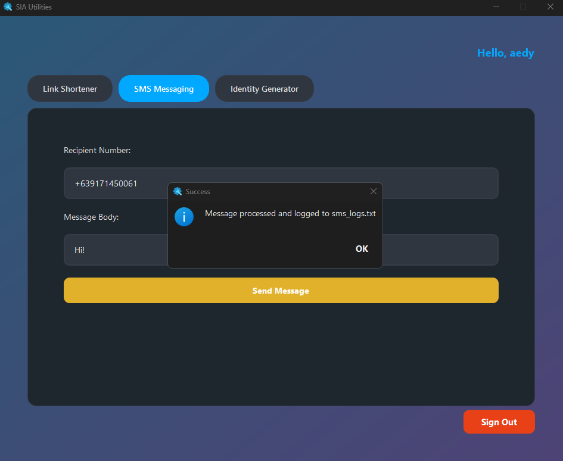
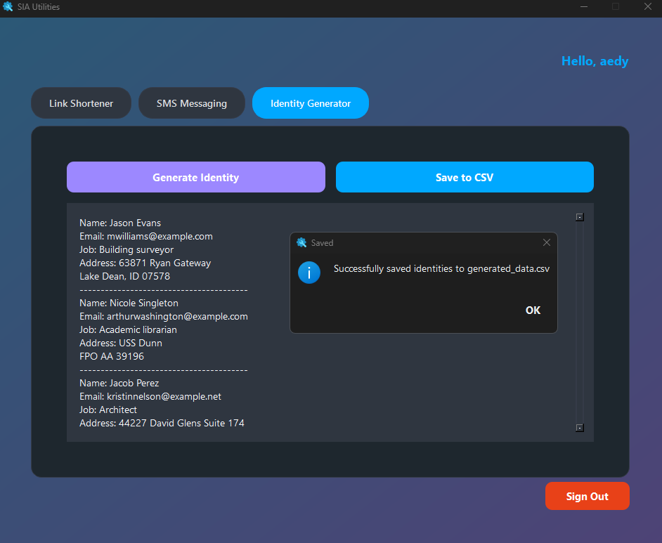

# SIA Mini Project

A Python desktop utility application developed as an individual academic project for **System Integration and Architecture (SIA)**.

The application combines multiple utilities into a single PyQt6-based desktop interface, including user authentication, URL shortening, SMS logging, and identity generation.

## Features

### 🔐 User Authentication

- User registration and login
- SQLite-based user accounts
- Password hashing
- Password visibility toggle
- Basic input validation

### 🔗 URL Shortener

- Shortens long URLs using TinyURL
- Uses the `pyshorteners` library
- Displays the shortened URL
- Copies the shortened URL to the clipboard

### 📱 SMS Messaging

- Enter a recipient number and message
- Basic input validation
- Records messages with timestamps
- Saves SMS activity to `sms_logs.txt`

> **Note:** The SMS feature currently logs messages locally and does not send messages through an SMS API.

### 🪪 Identity Generator

- Generates sample identity information using Faker
- Generates names, email addresses, jobs, and addresses
- Displays generated identities
- Exports generated data to CSV

## Technologies Used

- Python
- PyQt6
- SQLite
- Faker
- pyshorteners
- CSV
- TXT file handling

## Screenshots

### Login



### URL Shortener



### SMS Messaging



### Identity Generator



## Project Structure

```text
SIA-Mini-Project/
├── main.py
├── database.py
├── setup_db.py
├── utilities.py
├── requirements.txt
├── styles/
├── screenshots/
└── README.md
```

## Project Context

This project was developed as an **individual academic project** for the **System Integration and Architecture (SIA)** course.

The project demonstrates the integration of multiple utilities and supporting components into a single desktop application.

## Status

Completed academic project.
